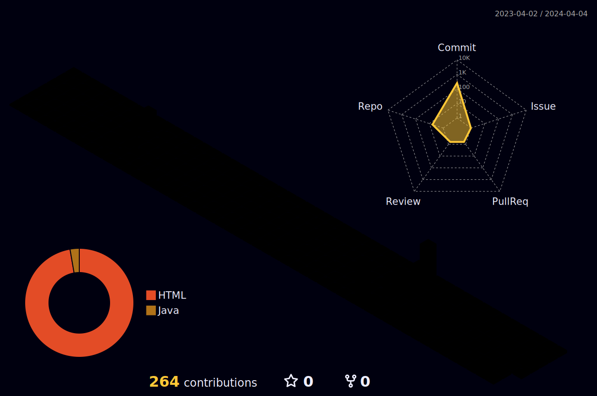
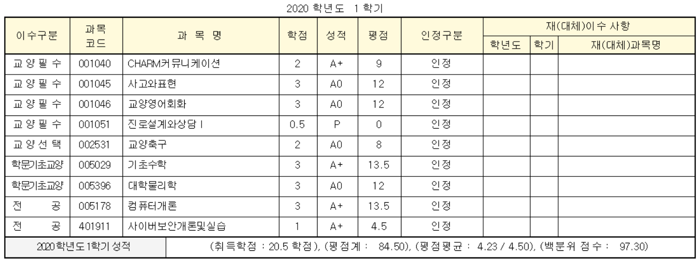
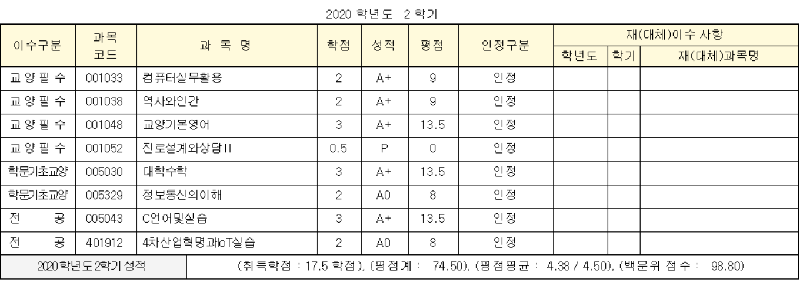
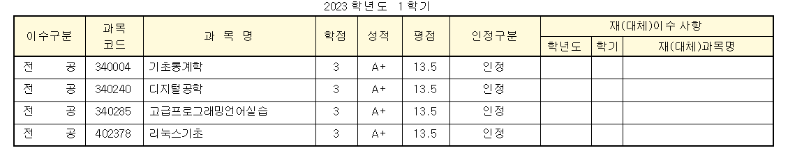
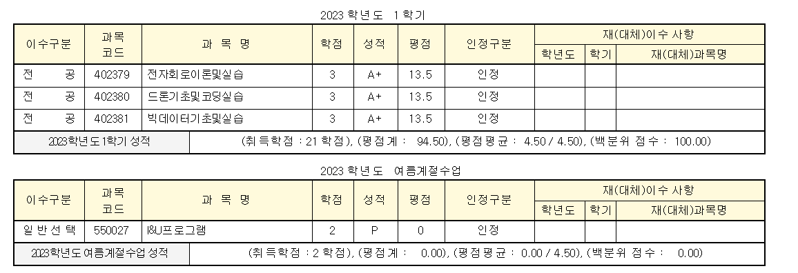
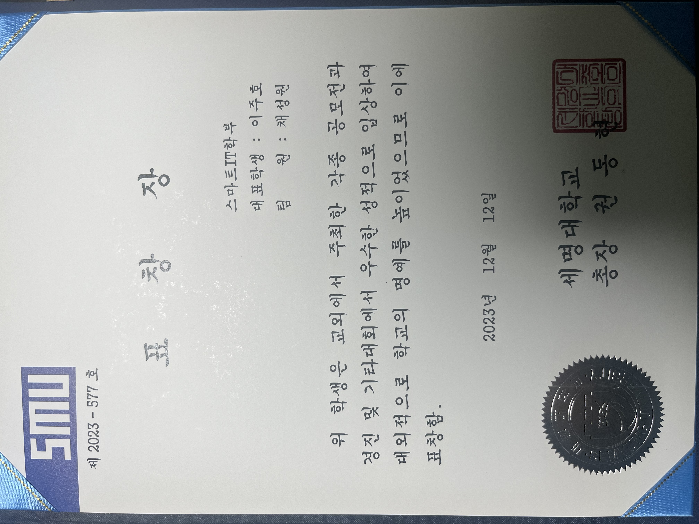
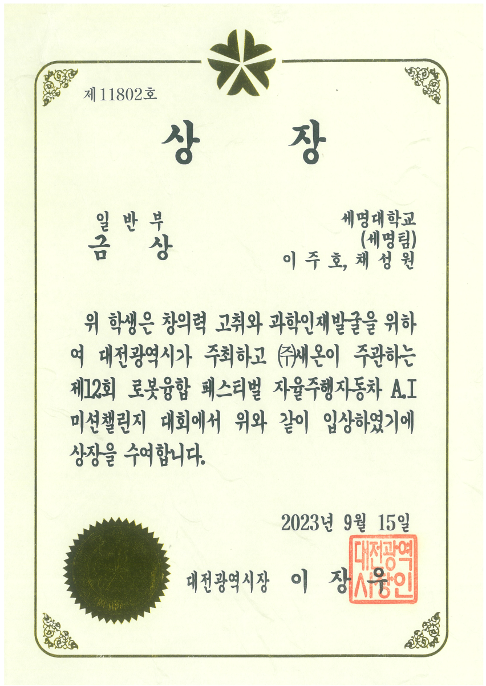

이주호(Juho Lee)
==================

 

# Introduction
안녕하세요! 세명대학교 스마트IT학부생이자, 현재, Embeded Programmer를 꿈꾸는 학생입니다.

Page: [ljh1901's Resume](https://ljh1901.github.io/ljh1901/)

# 연락(Contact)
* Email: [juho8690@gmail.com](https://gmail.com)
* instagram: [ljh05._.21](https://www.instagram.com/ljh05._.21)
* Github: [github.com/ljh1901](https://github.com/ljh1901)
* Tel: +82 010-8690-3944

 

# 목차(index)
- [학력](#학력-Education)
- [학점](#학점-Grade)
- [활동](#활동-Activity)
- [자격증](#자격증-License)
- [프로젝트](#프로젝트-Project)
- [경력](#경력-Career)
- [수상내역](#수상내역-Awards)

 

## 학력-Education
- 고등학교: 보성 고등학교 졸업
- 대학교: 세명 대학교 Smart IT 학부 재학중

 

## 학점-Grade

 

## 활동-Activity

[**I&U 프로그램**](http://www.semyung.ac.kr/cop/bbs/BBSMSTR_000000000207/selectBoardList.do?bbsId=BBSMSTR_000000000207&pageIndex=1&kind=&mno=sitemap_12&searchCnd=&searchWrd=)
> <I&U 프로그램>
> 세명대학교 SMART IT학부의 I&U 프로그램

* 기간 : 2023.05.03 ~ 2023.05.29
* 내용 : X500 드론 분해 후 조립
*        운영체재: LINUX 18.04
*        ROS 버전: ROS melodic
*        ROS desktop 환경의 Gazebo를 이용해 드론 시뮬레이션, Qground, Ardupilot을 이용한 X500조종
[**I&U 프로그램**](http://www.semyung.ac.kr/cop/bbs/BBSMSTR_000000000207/selectBoardList.do?bbsId=BBSMSTR_000000000207&pageIndex=1&kind=&mno=sitemap_12&searchCnd=&searchWrd=)
> <I&U 프로그램>
> 세명대학교 SMART IT학부의 I&U 프로그램
> 
* 기간 : 2023.11.03 ~ 2023.11.28
* 내용 : 3D프린팅 설계 - Jetson 보드 설계
* 프로그램: Rhino 7

## 자격증-License
*License*
|자격증|발행기관|발행연도|
|-|-|-|
|운전면허증 1종 보통|서울 지방 경찰청|2022. 10.17|
|SQLD|한국 데이터 산업 진흥원|2024.12.13|
|정보처리기사|한국 산업 인력 공단|2025.09.12|

##  프로젝트-Project

 

## 경력-Career

**대교문구**

> 창고 관리, 물건 관리, 카운터 업무 

> 기간: 2022.10.25 ~ 2023. 02.28(약 4개월)

 

## :trophy:수상내역-Awards:trophy:
# 세명대학교 총장 표창

# 새온 AI미션 챌린지 - 대전광역시장상
 Arduino Board를 활용 Arduino IDE를 통해 c++ 기반 자율 주행 Algorithm 개발

